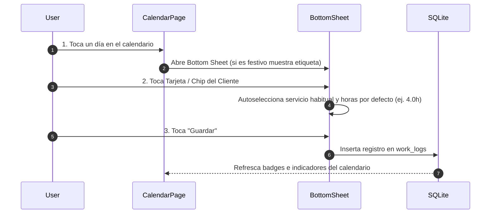

# Feature Spec: Calendario Interactivo y Alta Rápida (Tab 2)

## 1. Propósito
Visualización temporal del mes y registro de horas en exactamente 3 clics/toques.

## 2. Indicadores Visuales en el Calendario
* **Día Festivo de Bruselas**: Destacado con un estilo visual diferencial (ej. dorado/rojo) y tooltip/etiqueta informativa.
* **Día con Horas Trabajadas**: Badge informativo con la cifra total de horas (ej. `4.5h`) o indicador del cliente correspondiente.
* **Festivo Trabajado**: Indicador combinado (Badge de horas + marca de día festivo).

## 3. Flujo UX de Registro en 3 Clics

### Detalle de Pasos:
1. **Clic 1**: Tocar un día en el calendario $\rightarrow$ Se despliega el *Bottom Sheet*. En la cabecera se especifica la fecha y, si coincide con un festivo de Bruselas, se indica el nombre oficial.
2. **Clic 2**: Tocar la tarjeta/chip de un Cliente $\rightarrow$ La app autoselecciona el servicio habitual de dicho cliente y asigna las horas por defecto.
3. **Clic 3**: Tocar el botón **"Guardar"** $\rightarrow$ Se valida y almacena el registro en SQLite, cerrando el panel e incrementando dinámicamente el badge del día en el calendario.
