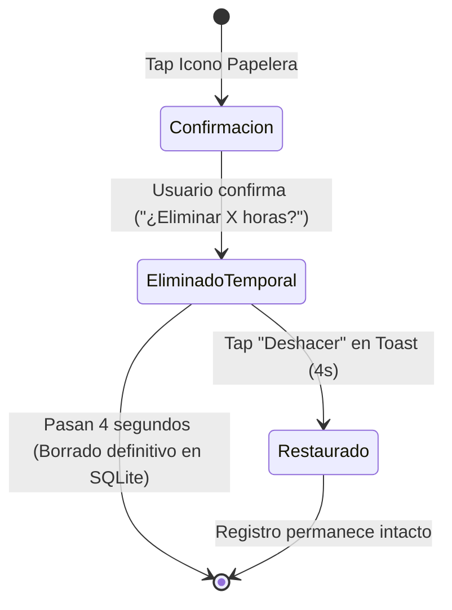

# Feature Spec: Historial de Registros de Trabajo (Tab 3)

## 1. Propósito
Consulta detallada, filtrado, modificación e inspección del histórico de entradas de trabajo con protección ante borrados accidentales.

## 2. Funcionalidades de Lista y Consulta
* **Orden**: Cronológico descendente (del registro más reciente al más antiguo).
* **Búsqueda**: Filtro por texto libre que busca dentro del campo `notes` (concepto/comentarios).
* **Filtro por Cliente**: Selector para filtrar la lista por un cliente específico o ver todos.
* **Detalle**: Tocar una entrada expande los detalles: Cliente, Servicio prestado, Horas acumuladas, Notas y si coincidió con un festivo.

## 3. Edición de Registros
* Botón "Editar" despliega un formulario modal pre-poblado.
* Selectores de cliente/servicio e incrementables (`-` / `+` con pasos de 0.5h) para ajustar las horas entre 0.5h y 24.0h.

## 4. Regla de Borrado Seguro (Undo Window)

1. **Alerta de Confirmación**: Al pulsar la papelera salta una alerta nativa `ion-alert`:
   > *"¿Eliminar [X] horas de [Cliente]?"*
2. **Ventana de Gracia (Toast de 4 Segundos)**:
   * Al confirmar, el registro se oculta inmediatamente de la interfaz y se dispara un `ion-toast` durante **4 segundos**.
   * El toast incluye la opción **"Deshacer" (Undo)**.
   * Si el usuario presiona "Deshacer" dentro del intervalo de 4s, la eliminación se cancela y el registro se mantiene intacto.
   * Si no se pulsa, transcurridos los 4 segundos se ejecuta el `DELETE` físico en la base de datos SQLite local.
