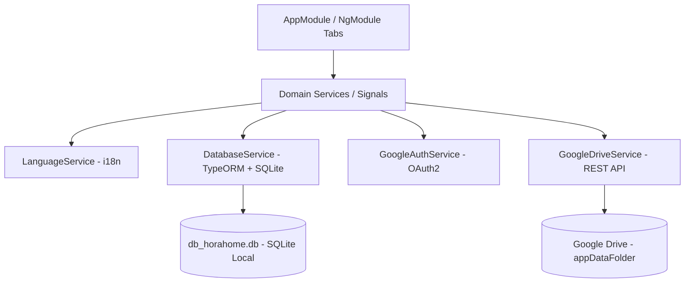

# Design: HoraHome Technical & Architecture Specification

## Architecture Overview (NgModule Architecture)

HoraHome follows a clean, modular architecture leveraging Ionic 8 and Angular 18 `NgModule` components with TypeORM and `@ngx-translate/core`.



## TypeORM Entities (English Domain)

```typescript
// client.entity.ts
@Entity('clients')
export class Client {
  @PrimaryGeneratedColumn('uuid') id: string;
  @Column({ type: 'varchar' }) name: string;
  @Column({ type: 'varchar', nullable: true }) address?: string;
  @Column({ type: 'varchar', nullable: true }) phone?: string;
  @Column({ type: 'decimal', precision: 10, scale: 2, default: 0.0 }) hourlyRate: number;
  @Column({ type: 'boolean', default: true }) isActive: boolean;
  @CreateDateColumn() createdAt: Date;
  @OneToMany(() => WorkLog, (workLog) => workLog.client) workLogs: WorkLog[];
}

// service.entity.ts
@Entity('services')
export class Service {
  @PrimaryGeneratedColumn('uuid') id: string;
  @Column({ type: 'varchar', unique: true }) name: string;
  @OneToMany(() => WorkLog, (workLog) => workLog.service) workLogs: WorkLog[];
}

// work-log.entity.ts
@Entity('work_logs')
export class WorkLog {
  @PrimaryGeneratedColumn('uuid') id: string;
  @Column({ type: 'date' }) workDate: string;
  @ManyToOne(() => Client, (client) => client.workLogs, { onDelete: 'RESTRICT' }) client: Client;
  @ManyToOne(() => Service, (service) => service.workLogs, { onDelete: 'RESTRICT' }) service: Service;
  @Column({ type: 'decimal', precision: 4, scale: 2 }) hours: number;
  @Column({ type: 'text', nullable: true }) notes?: string;
  @CreateDateColumn() createdAt: Date;
}

// brussels-holiday.entity.ts
@Entity('brussels_holidays')
export class BrusselsHoliday {
  @PrimaryColumn({ type: 'date' }) holidayDate: string;
  @Column({ type: 'varchar' }) nameFr: string;
  @Column({ type: 'varchar' }) nameNl: string;
  @Column({ type: 'integer' }) year: number;
}
```

## Internationalization (i18n) Configuration
- Translation assets stored in `src/assets/i18n/es.json` (Default), `en.json`, and `fr.json`.
- Integrated via `TranslateModule.forRoot({...})` in `AppModule`.
- `LanguageService` stores active language in LocalStorage/Preferences and synchronizes with `@ngx-translate/core`.

## State Management & Reactive Services
- `DatabaseService`: Manages TypeORM `DataSource` initialization over `@capacitor-community/sqlite`, seeds initial service catalog (`Cleaning`, `Childcare`, `Ironing`, `Cooking`), and provides entity repositories.
- `GoogleAuthService`: Signal state `currentUser = signal<GoogleUser | null>(null)` holding authenticated user profile and access token.
- `GoogleDriveService`: Handles database file export (`@capacitor/filesystem`), upload to `appDataFolder` via REST multipart POST/PATCH, and restoration download.
